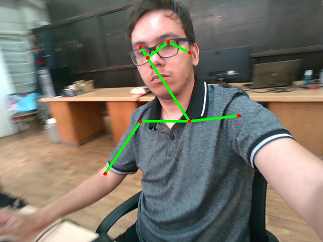
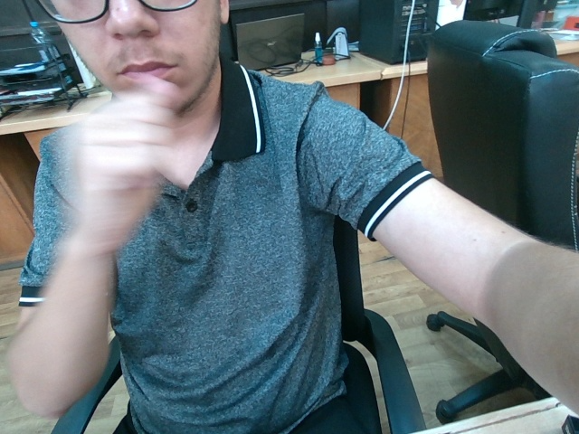

<h1> Pose Estimation using OpenPose in Python at IMSAR </h1>
 
<h2>Features</h2>
<ul>
    <li>open_pose.py: take pictures with pose detection and annotations (No Pose / Pose Drawn)</li>
    <li>labels.txt: targets for each photo</li>
    <li>graph_opt.pb: open pose model</li>
    <li>dl.ipynb: model training with images and their labels and evaluating, accuracy: 0.94</li>
    <li>pose_detection_model.h5: model saved</li>
</ul>

<h2>Acknowledgments</h2>

<b> Python3: http://bit.ly/python3-certifications </b>
 
<b> Machine Learning: https://bit.ly/machine-learning-certification <b>
 

<h2>Photo</h2>
<h4>Pose Drawn</h4>

 
<h4>No Pose</h4>

 
<h2>Contact</h2>

<b> Email: mariusc0023@gmail.com </b>
